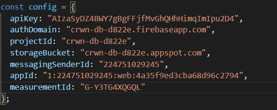
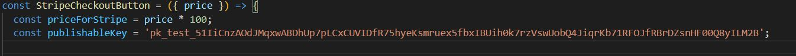

# crwn-clothing
The project focuses on creating a full fledged e-commerce application where the customer can place orders. The project goal is to familiarize myself with react, react-redux and react-router-dom.

##Live Demo:
https://crwn-clothing-react-mav.herokuapp.com/

## Project Screen Shot(s)

  
   
  
  
  

## Installation and Setup Instructions
Clone down this repository. You will need `node` and `npm` installed globally on your machine.  

Installation:

`npm install`  

Change the firebase keys in "firebase.utils.js" 

  

Change the Stripe public key in "stripe-button.component.jsx" 

  

To Run Test Suite:  

`npm test`  

To Start Server:

`npm start`  

To Visit App:

`localhost:3000`  

## Credit
 ZhangMYihua 
